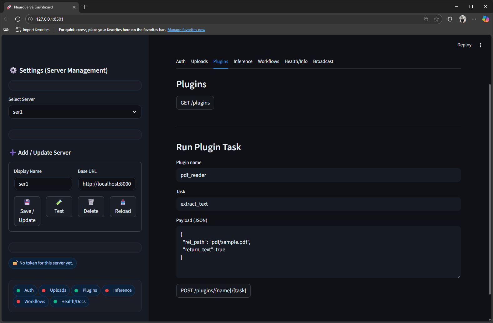

# 🚀 NeuroServe Dashboard (Multi-Server Orchestrator)


  
[](https://github.com/TamerOnLine/repo-fastapi/actions/workflows/ci-ubuntu.yml)
[](https://github.com/TamerOnLine/repo-fastapi/actions/workflows/ci-windows.yml)
[](https://github.com/TamerOnLine/repo-fastapi/actions/workflows/ci-macos.yml)
[](https://github.com/TamerOnLine/repo-fastapi/actions/workflows/ci-gpu.yml)  

[](https://paypal.me/tameronline)

---

## 📖 Overview
**NeuroServe Dashboard** is a flexible framework to manage and run **multiple FastAPI servers** through a **Streamlit dashboard**, orchestrated by a central script `run_all.py`.  
It supports:
- Running multiple services with **health checks** before continuing to the next.
- Server management (add/delete/test connectivity/store tokens).
- **Broadcast requests** to send the same request to all servers at once.
- **Plugins & Workflows system** for easy extensibility.

---

## ✨ Features
- 🔄 **Orchestration**: Run API + UI with one command.
- 📊 **Streamlit Dashboard** with a professional interface.
- 🔌 **FastAPI Plugins & Workflows** ready to extend.
- 🧠 **Unified Inference API** for simplified calls.
- 🎨 **Custom CSS Theme** (neuroserve.css).
- 🛡️ **JWT Authentication (demo)**.

---

## 🧱 Architecture
```text
repo-server/
├─ fastapi/      # FastAPI server (APIs, Plugins, Workflows, Docs, Tests)
├─ streamlit/    # Streamlit dashboard + .streamlit/servers.json
├─ run_all.py    # Orchestrator: launches + health checks + graceful shutdown
└─ servers.json  # Service definitions (paths, python_exe, health URLs…)
```

---

## ⚡ Quick Setup

### 1. Clone
```bash
git clone https://github.com/TamerOnLine/repo-server
cd repo-server
```

### 2. Virtualenvs (recommended)
```bash
cd fastapi
python -m venv .venv
.venv\Scripts\activate
pip install -r requirements.txt

cd ../streamlit
python -m venv .venv
.venv\Scripts\activate
pip install -r requirements.txt
```

---

## 🚀 Run with Orchestrator

```bash
py -m run_all        # start API + Dashboard
py -m run_all api    # start only API
```

Example `servers.json`:
```json
{
  "launch_order": ["api", "streamlit"],
  "services": {
    "api": {
      "cwd": "fastapi",
      "python_exe": "fastapi/.venv/Scripts/python.exe",
      "cmd": ["-m", "uvicorn", "main:app", "--app-dir", "app", "--host", "127.0.0.1", "--port", "8000", "--reload"],
      "health": "http://127.0.0.1:8000/health"
    },
    "streamlit": {
      "cwd": "streamlit",
      "python_exe": "streamlit/.venv/Scripts/python.exe",
      "cmd": ["-m", "streamlit", "run", "app.py", "--server.address", "127.0.0.1", "--server.port", "8501"],
      "health": "http://127.0.0.1:8501/_stcore/health",
      "exports": { "url": "http://127.0.0.1:8501" }
    }
  }
}
```

---

## 🖥️ Streamlit Dashboard
- **Sidebar**: Manage servers (add/edit/delete/test).  
- **Tabs**:
  - 🔑 Auth (`/auth/login`, `/auth/me`)
  - 📂 Uploads (`/uploads`)
  - 🔌 Plugins (`/plugins/{name}/{task}`)
  - 🧠 Inference (`/inference`)
  - 🔗 Workflows (`/workflows/run`)
  - ❤️ Health & Info (`/`, `/docs`, `/redoc`)
  - 📢 Broadcast (send request to all servers)

---

## ⚙️ FastAPI Server
- Core endpoints: `/health`, `/env`, `/plugins`, `/workflows`.
- Routers: **Auth, Uploads, Plugins, Inference, Services, Workflows**.
- Includes **CORS, Logging, Unified Responses**.

---

## 🔌 Plugins & Workflows
- Plugins under: `app/plugins/<name>/`
- Workflows under: `app/workflows/<name>/`

API:
```http
POST /plugins/{name}/{task}
POST /inference
POST /workflows/run
```

---

## 🎨 Customization
UI customization via:  
`streamlit/.streamlit/neuroserve.css`

---

## 🖼️ Screenshots
<p align="center">
  
</p>

---

## 🏭 Deployment Notes
- Run Uvicorn behind a reverse proxy (e.g., Nginx).  
- Use environment variables `APP_*` instead of hardcoded values.  
- Docker setup is planned in the roadmap.  

---

## 🤝 Contributing
- Open **Issues** for ideas or bugs.  
- Submit **Pull Requests** for improvements.  
- Follow style guidelines (Ruff + pre-commit).  
- See [Code Style Guide](fastapi/docs/CODE_STYLE_GUIDE.md).  

---

## 🗺️ Roadmap
- [ ] Docker one-click deployment.  
- [ ] CLI generator for Plugins & Workflows.  
- [ ] Extended Auth system (JWT + user management).  
- [ ] Expanded integration tests (CI/CD).  
- [ ] Example Plugins: translation, summarization, image classification.  

---

## 📜 License
Licensed under the **MIT License** → [LICENSE](./LICENSE).  
⚠️ Some AI/ML models have separate licenses: [Model Licenses](fastapi/docs/LICENSES.md).
