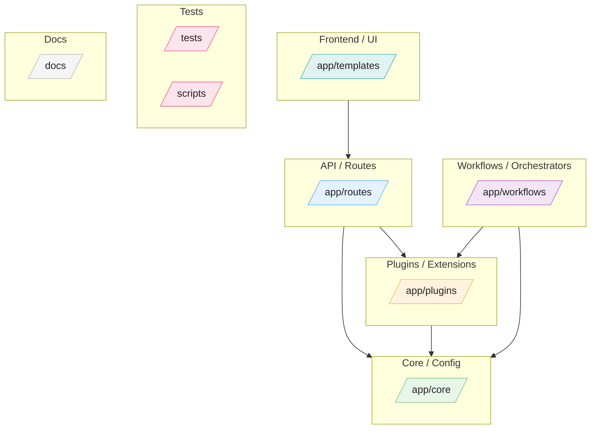
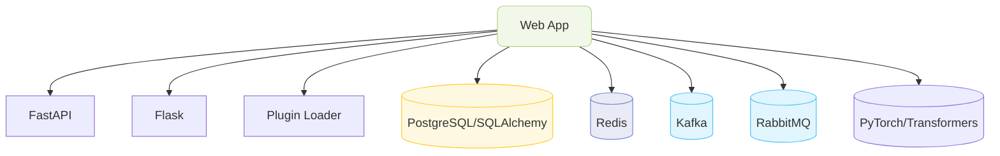

# 🏗️ Project Architecture (Auto‑generated)
**Detected stack:** PyTorch, FastAPI, Transformers, Redis, Flask, Django, Next.js, psycopg, Kafka, RabbitMQ

## 1) Folder Buckets


## 2) Runtime & Infrastructure (derived)


## 3) Python Import Graph (top‑level)
```mermaid
flowchart TB
```

## 4) Detected Endpoints
| Framework | Method | Path |
|---|---|---|
| fastapi | `GET` | `/` |
| fastapi | `GET` | `/_boom` |
| fastapi | `GET` | `/_forbidden` |
| fastapi | `GET` | `/_not-impl` |
| fastapi | `POST` | `/_payload-too-large` |
| fastapi | `GET` | `/_timeout` |
| fastapi | `GET` | `/_too-many` |
| fastapi | `GET` | `/_unauth` |
| fastapi | `GET` | `/_unavailable` |
| fastapi | `POST` | `/_unsupported-media` |
| fastapi | `POST` | `/_validate` |
| fastapi | `GET` | `/env` |
| fastapi | `GET` | `/favicon.ico` |
| fastapi | `GET` | `/health` |
| fastapi | `GET` | `/ping` |
| fastapi | `GET` | `/presets` |
| fastapi | `POST` | `/run` |
| fastapi | `GET` | `/{name}` |
| fastapi | `POST` | `/{name}/{task}` |

## Buckets listing
- **API / Routes:** `app/routes`
- **Core / Config:** `app/core`
- **Plugins / Extensions:** `app/plugins`
- **Workflows / Orchestrators:** `app/workflows`
- **Frontend / UI:** `app/templates`
- **Tests:** `tests`<br>`scripts`
- **Docs:** `docs`

> Generated by `gen_arch.py`. Customize buckets or detection rules inside the script.
